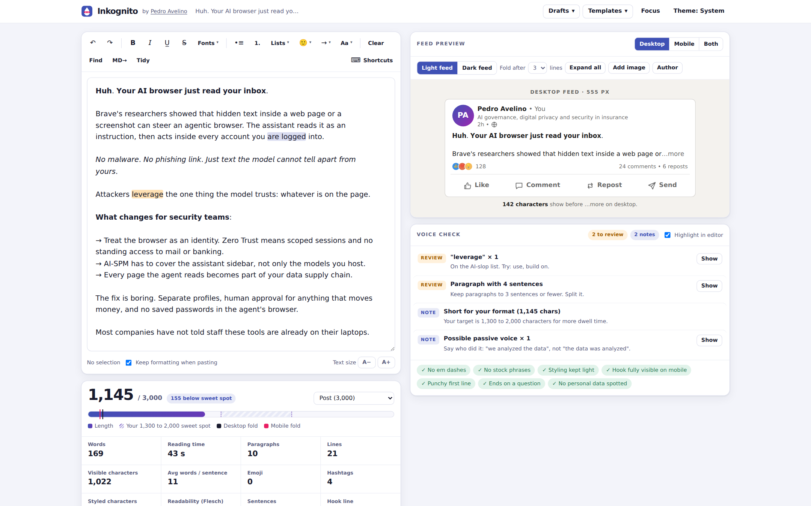

<div align="center">

# Inkognito

**A locally launched, privacy-first LinkedIn formatter for self-hosting.**
Your data, your thoughts are yours to keep on your own machine. Works on Windows, Linux and Mac.

[](https://github.com/4velinux/inkognito/actions/workflows/ci.yml)
[](https://github.com/4velinux/inkognito/releases/latest)
[](#install)
[](LICENSE)



</div>

## Why another formatter?

Every popular LinkedIn formatter is a web page on someone else's server. Your unpublished drafts, client names and half-finished opinions pass through it, next to analytics and ad scripts.

Inkognito is a single HTML file. Launch it on your own computer with one command, open it straight from disk, or host it on your Proxmox box or Docker. A strict Content Security Policy blocks every outbound connection, so even a bug could not leak your text. The footer shows a live count of network requests, and it stays at zero.

## Features

**Formatting**
- Bold, italic and bold italic that toggle and combine. Press Bold with nothing selected and everything you type comes out bold.
- 22 Unicode letter styles with live previews, including serif, monospace, script, gothic, double-struck, small caps, circled, squared, superscript and upside-down. Risky ones are marked because they can show as boxes on older phones.
- Underline, double underline, strikethrough, slash and overline that stack on any style.
- List markers (• → ✓ ▸ ◆ ✅ 👉 1. 1️⃣), emoji and symbol pickers, dividers, case changes, find and replace that matches styled letters.
- Paste from Google Docs or Word and bold, italic, strikethrough and lists survive. Paste Markdown and it is converted.

**Preview**
- Desktop feed (555 px) and mobile app (390 px) side by side, in light or dark feed.
- The "…more" fold is measured on your actual text, with the number of characters that show before it.
- Attach an image, set the author name and headline, preview a profile headline.

**Checks**
- Character meter for posts, comments, headlines, About, invite notes and article titles, with a 1,300 to 2,000 sweet spot and the fold positions marked.
- Voice check: em dashes, AI-slop words and stock phrases, long paragraphs, a hook cut off on mobile, a missing closing question, styled hashtags that will not link, plain @names that will not tag.
- **Privacy check:** emails, phone numbers, card numbers (Luhn), Thai national IDs (checksum), IBANs, API keys and tokens, private IPs and internal hostnames, and tracking parameters in links (one click to strip them).

**Drafts**
- Unlimited drafts saved in your browser, templates, export and import as JSON, one-click erase of all local data.

## Install

One installer per platform. It figures out where it is running and does the right thing.

| Where | Run this | What you get |
|---|---|---|
| **Windows** (PowerShell) | `irm https://raw.githubusercontent.com/4velinux/inkognito/main/install.ps1 \| iex` | App in `%LOCALAPPDATA%\Inkognito`, a Start menu entry, served on `http://localhost:8765`, browser opens |
| **macOS / Linux** (Terminal) | `bash -c "$(curl -fsSL https://raw.githubusercontent.com/4velinux/inkognito/main/install.sh)"` | App in your user folder, an `inkognito` command, served on `http://localhost:8765`, browser opens |
| **Proxmox VE** (host shell) | the same `install.sh` line | Detects Proxmox and acts as a helper script: creates a tiny Alpine LXC for your whole network |
| **No install** | download [`inkognito.html`](https://github.com/4velinux/inkognito/releases/latest/download/inkognito.html) and double-click it | Works the same, straight from disk |

No admin rights, no package manager, nothing to compile. On macOS and Linux the local server uses the Python 3 that is already on most systems (Ruby as a fallback). If neither exists, Inkognito simply opens from disk.

### Everyday use

| | macOS / Linux | Windows |
|---|---|---|
| Open | `inkognito` | Start menu → Inkognito |
| Stop | `inkognito --stop` | `& "$env:LOCALAPPDATA\Inkognito\inkognito.ps1" -Stop` |
| Start at login | `inkognito --autostart on` | `... inkognito.ps1 -Autostart on` |
| Update | `inkognito --update` | `... inkognito.ps1 -Update` |
| Status | `inkognito --status` | `... inkognito.ps1 -Status` |
| Remove | `inkognito --uninstall` | `... inkognito.ps1 -Uninstall` |

Options: `--port 9000` / `-Port 9000`, `--no-browser` / `-NoBrowser`, and on macOS/Linux `--lan` to let other devices on your network open it.

**The local server listens on `127.0.0.1` only.** Other computers cannot reach it unless you pass `--lan`. Launching never touches the internet. Only the first install and `--update` download the app, from GitHub releases, and the installer checks the SHA-256 checksum before using it.

Autostart uses what your system already has: a systemd user service on Linux, a LaunchAgent on macOS, a Startup shortcut on Windows.

## Self-host on Proxmox VE

Run the `install.sh` line above in the **Proxmox host shell**, or call the helper directly:

```bash
bash -c "$(wget -qLO - https://raw.githubusercontent.com/4velinux/inkognito/main/proxmox/inkognito-lxc.sh)"
```

It creates an unprivileged Alpine Linux container (1 core, 64 MB RAM, 1 GB disk) with lighttpd and the app, and it checks for new releases every night. Want it on the host itself instead? Pick option 2 in the menu, or pass `--local`.

Settings can be changed with environment variables:

```bash
CTID=150 CT_NET=192.168.1.50/24 CT_GW=192.168.1.1 \
  bash -c "$(wget -qLO - https://raw.githubusercontent.com/4velinux/inkognito/main/proxmox/inkognito-lxc.sh)"
```

| Variable | Default | What it does |
|---|---|---|
| `CTID` | next free ID | Container ID |
| `CT_HOSTNAME` | `inkognito` | Hostname |
| `CT_CORES` / `CT_RAM` / `CT_DISK` | `1` / `64` MB / `1` GB | Resources |
| `CT_BRIDGE` / `CT_VLAN` | `vmbr0` / none | Network bridge and VLAN tag |
| `CT_NET` / `CT_GW` | `dhcp` | Static address in CIDR form, plus gateway |
| `CT_STORAGE` / `TPL_STORAGE` | auto | Storage for the container and the template |
| `INKOGNITO_REPO` | `4velinux/inkognito` | Install from your fork |
| `CHANNEL` | `release` | `release` = tagged, checksum-verified versions; `main` = every commit |
| `AUTO_UPDATE` | `yes` | Nightly update check |
| `INKOGNITO_YES` | unset | `1` skips the confirmation prompt |

Inside the container:

```bash
pct exec <CTID> -- inkognito-update              # update now
pct exec <CTID> -- inkognito-update --rollback   # previous version
pct exec <CTID> -- inkognito-update --status     # what is live
```

The updater refuses any file whose checksum does not match the release, and any build that has lost its privacy lock.

## Docker

```bash
docker compose up -d        # http://localhost:8080
```

The image is Alpine plus lighttpd, runs as a non-root user with a read-only filesystem and no capabilities.

## Good to know

- **Drafts are stored per address.** The file on disk, `http://localhost:8765`, `http://192.168.1.50` and `http://localhost:8080` each keep their own drafts, which is why the launcher remembers its port. Use Drafts → Export all and Import to move them.
- **Copy works everywhere.** On plain `http://` addresses the browser clipboard API is off, so Inkognito falls back to the classic copy command automatically.
- **Keep it on your network.** For access away from home, use Tailscale or WireGuard rather than opening a port.
- **About styled letters:** they are Unicode look-alikes, the same technique every formatter uses. Screen readers may spell them out and LinkedIn search does not index them, so style a few key phrases, not whole posts. The checker warns you when styling passes 25% of letters.

## Contributing

Pull requests are welcome. Read [CONTRIBUTING.md](CONTRIBUTING.md). The one rule that is never negotiable: **no network requests**, ever.

## License

[MIT](LICENSE). Made in Thailand by [Pedro Avelino](https://github.com/4velinux).
